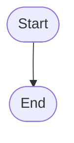

4. Implement the Flowchart:
o Layout the process this guessing game needs to handle
o Consider possible edge cases and how they should be handled in your tests.
5. Documentation:
o Under the flow chart, provide a textual description of each step of the
process
6. Submission:
o Commit and push your changes to your GitHub repository.
o Submit the link to your Guessing.md file in the assignment submission
portal.
Evaluation Criteria:
• Completeness of the flowchart covering all necessary components of the game.
• Clarity and readability of the documentation in the markdown file.
